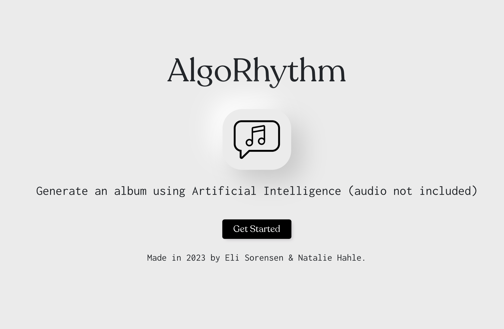

# AlgoRhythm
## Generating Conceptual Albums using AI
### A project by Eli Sorensen and Natalie Hahle

A web application that generates conceptual album titles, covers, and track listings using machine learning.

## Features
* Album and song title generation based on a text prompt
* Text to image album cover generation from a fine-tuned [Stable Diffusion](https://huggingface.co/spaces/stabilityai/stable-diffusion) model
* Fast API back end for easy REST requests to each individual model for generating song/album titles and images

## Installation and running

### Before you begin:
[Download the checkpoint file](https://drive.google.com/file/d/1-3xTe0AJgS9BYKKvju528WFS4Le4sZrk/view?usp=share_link) for the fine-tuned stable diffusion model and place it in the following sub-directory of the project: `src\stable-diffusion-webui\models\Stable-diffusion`.

### 1. Running the back end

a. Create a new python virtual environment in the project directory. 

b. Activate your newly created virutal environment in your shell of choice.

c. Navigate to `src\stable-diffusion-webui.`

d. Install the requirements listed in requirements.txt to your virtual environment.

e. Run the launch script with the following arguments: `launch.py --api`. Verify that the api is running by visiting the base address printed out in the console window.

\* For running the back end on Apple Silicon, visit [this resource](https://github.com/AUTOMATIC1111/stable-diffusion-webui/wiki/Installation-on-Apple-Silicon) from Stable Diffusion web UI.

### 2. Running the front end

**The front end will not work if the back end is not running.**

a. Install [yarn](https://yarnpkg.com).

b. In a new shell window, navigate to the project directory and issue the command `yarn install`.

c. After required project dependencies have installed, use the command `yarn start` to run the react app. Visit `localhost:3000` to use the application.

## Credits

This projcet utilizes AUTOMATIC1111's [Stable Diffusion web UI](https://github.com/AUTOMATIC1111/stable-diffusion-webui) as the basis for its Fast API back end.

Modifications to this project are the addition of two new endpoints and their subsequent sattelite methods within this project directory located at `src\stable-diffusion-webui\`. The license for this project is also located within this directory.

* [Fast Stable Diffusion Dreambooth fine tuning by TheLastBen](https://github.com/TheLastBen/fast-stable-diffusion)

* [Generating Scientific Papers Titles Using Machine Learning](https://towardsdatascience.com/generating-scientific-papers-titles-using-machine-learning-98c8c9bc637e)

